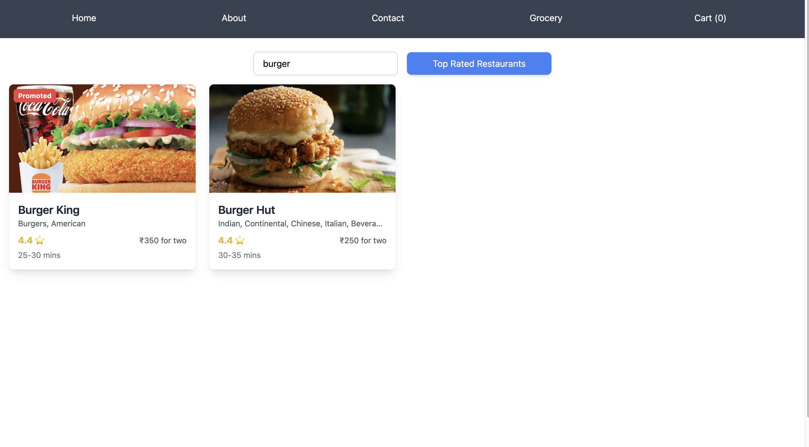
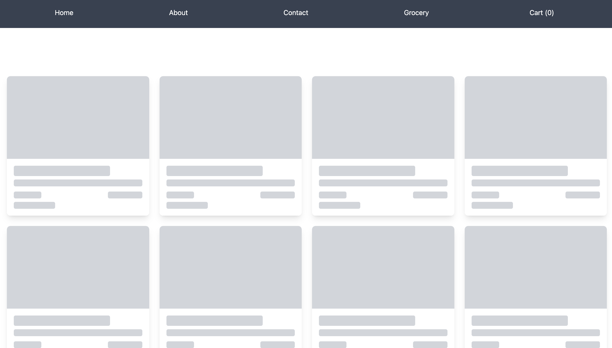
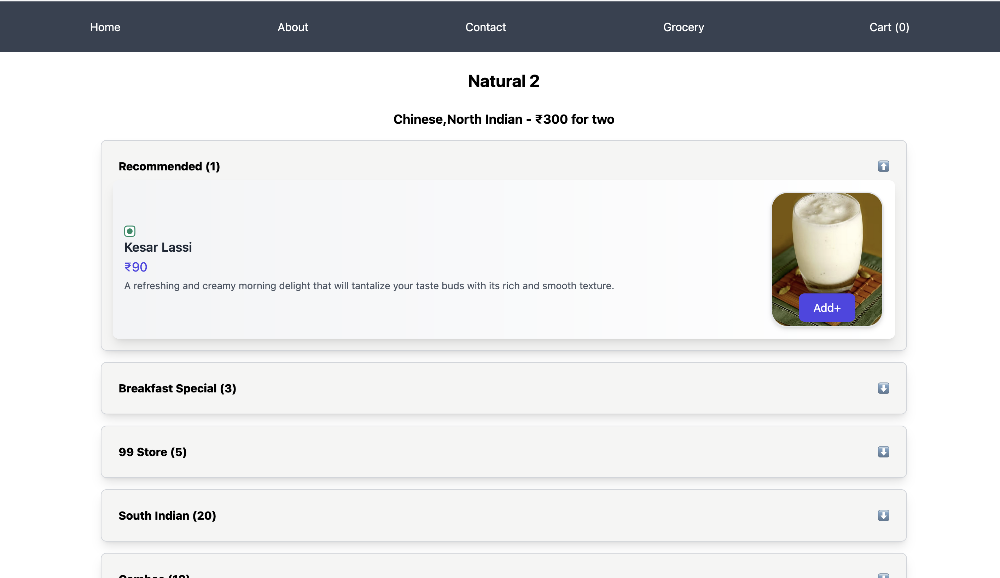
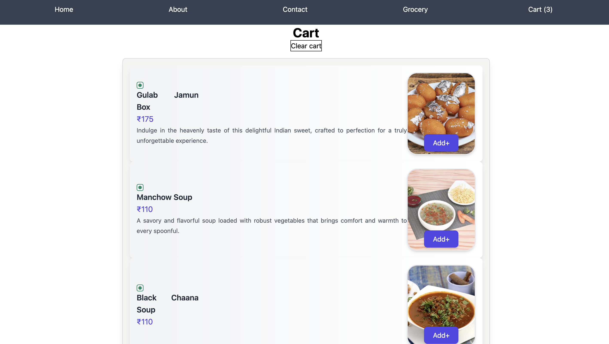
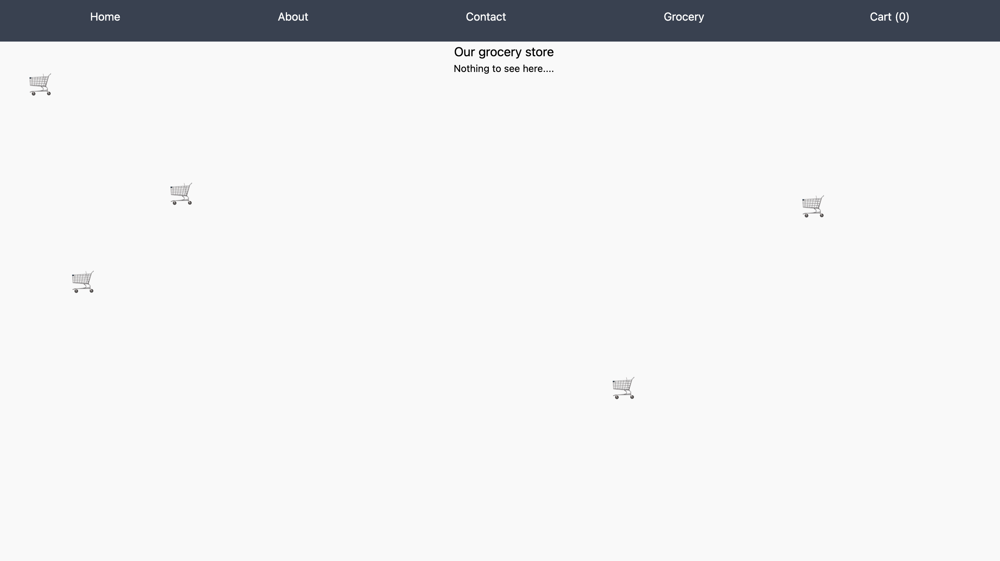

# Swiggy clone

A swiggy clone built using React. Features include restaurant listings, menus, search, filtering, shimmer UI, and add-to-cart functionality.

## Screenshots

---

---

---

---

---


To run the app:  
`npm start`  

To build the app:  
`npm run build`  

To run the tests:  
`npm run test`

## App structure

- **Header**
  - Logo
  - Nav Items

- **Body**  
  - Search
  - RestaurantContainer
  - RestaurantCard
    - img
    - Name of Restaurant, Star Rating, Cuisine, Delivery Time

- **Footer**
  - Copyright
  - Links
  - Address
  - Contact

## Steps involved in setting up testing in this app  

1. Install React Testing Library  
2. Install Jest  
3. Install Jest dependency Babel  
4. Configure Babel  
5. Configure Parcel config file to disable default Babel transpilation  
6. Jest - `npx jest --init`  
7. Install jsdom library  
8. Install `@babel/preset-react` to make JSX work in test cases  
9. Include `@babel/preset-react` inside Babel configuration  
- Add this to `babel.config.js`:  
  ```javascript
  ['@babel/preset-react', { runtime: "automatic" }]
  ```
10. Install Jest DOM:  
    ```sh
    npm i -D @testing-library/jest-dom
    ```